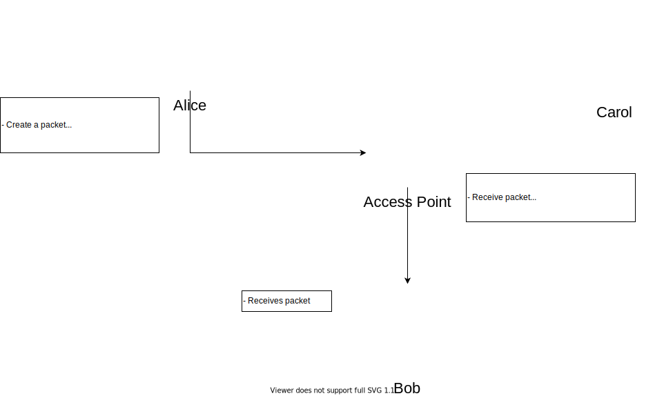

# Two Attacks On Wep
A rigorous and increasingly frustrating homework assignment for CS165 Computer Security 
Written by Jacob Tan and Richard Duong 

### Objective:
Demonstrate the vulnerabilities of CRC-32 and WEP protocol with the use of 2 different attacks: 
1. **The packet-redirect attack** which takes advantage of CRC32's linearity property to modify the destination of the ip header,
and tricks the Access Point into decrypting the packet before sending it off to the attacker. 
2. **The "chop chop" attack** which also takes advantage of CRC32's linearity property and as long as the Access Point
returns an acknowledgement for whether the message was accepted or not, one could recover the plaintext by guessing the
plaintext byte-by-byte.
 
-----------------------------------------------------------------------------------------------------------------------
## The Packet-Redirect Attack

### Client / Server Architecture

We ran into an issue with our design with determining how we would forward packets to ip addresses. 
So instead we came up with an alternative design: 
- We map an ip address to a specific port e.g. alice's ip -> port 50000 
- We will have alice, carolWEP, and AP as client to send and transmit packets; CarolWEP, AP, Carol, and Bob as servers to receive packets 
- We would have CarolWEP edit half the packets and send the received packets to AP, which would decrypt and send to the appropriate receivers. 

This mapping of IPV4 addresses to ports has its flaws, we can't emulate CarolWEP utilizing the Man in the Middle attack because it cannot spoof itself 
However it still demonstrates the attack on the encryption / packet validity over CRC32 and WEP Protocol very clearly. 

 
### Port Mapping

| Entity           	| IPv4            	| Port  	|
|------------------	|-----------------	|-------	|
| **Alice**        	| 169.235.16.75   	| 50000 	|
| **CarolWEP**     	| 100.100.100.100 	| 49500 	|
| **Access Point** 	| 255.255.255.255 	| 49000 	|
| **Bob**          	| 141.212.113.199 	| 48500 	|
| **Carol**        	| 128.2.42.95     	| 48000 	|
